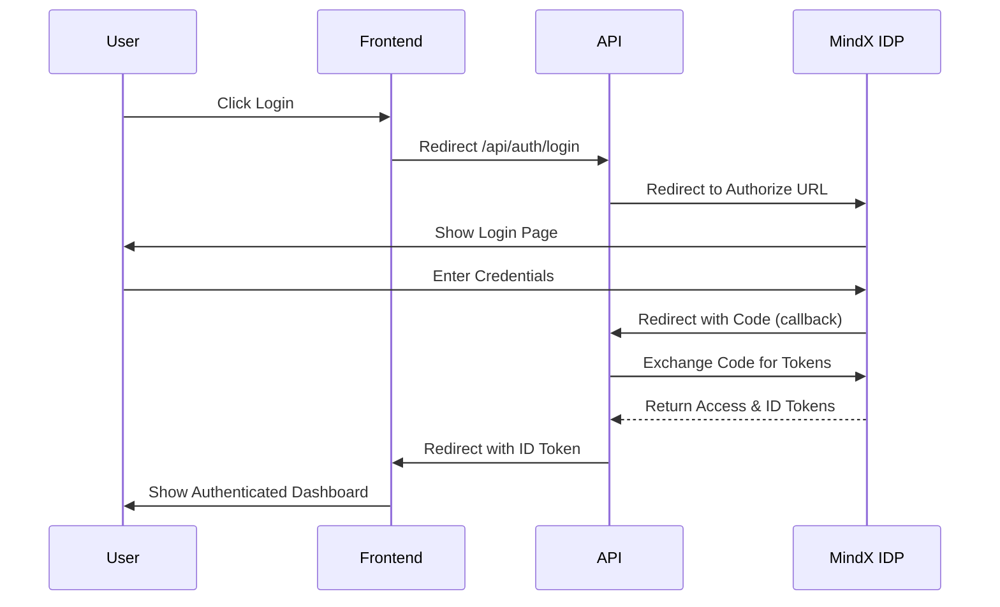

# MindX Probation Project - Secured Dashboard

This project demonstrates a full-stack application deployed on Azure Kubernetes Service (AKS), featuring a React frontend (Vite) and an Express.js API. It implements OpenID Connect authentication and secure dashboard functionality.

**Live Demo**: [https://mindx-devtunglam.52.234.236.158.nip.io](https://mindx-devtunglam.52.234.236.158.nip.io)

## Architecture

- **Frontend**: React + TypeScript + Vite (`/web`)
- **Backend**: Node.js + Express (`/api`)
- **Infrastructure**: Azure Kubernetes Service (AKS), Azure Container Registry (ACR), Nginx Ingress Controller.

## Prerequisites

- Docker
- Kubernetes CLI (`kubectl`)
- Azure CLI (`az`)
- Access to the `mindxprobationarc` Azure Container Registry.

## Setup

### Environment Variables

The application requires the following environment variables to be set for the API. You can create a `.env` file in the `api` directory based on the example below.

**`api/.env`**:

```env
# Port for the API server (default: 3000)
PORT=3000

# MindX Identity Provider Configuration
CLIENT_ID=mindx-onboarding
CLIENT_SECRET=YOUR_ACTUAL_CLIENT_SECRET  # Required
AUTH_ENDPOINT=https://id-dev.mindx.edu.vn/auth
TOKEN_ENDPOINT=https://id-dev.mindx.edu.vn/token

# Redirect URIs
# URI where the IDP redirects back to the API with the auth code
REDIRECT_URI=http://localhost:3000/api/auth/callback
# URI where the API redirects the user's browser after successful login (with token)
FRONTEND_CALLBACK_URL=http://localhost:5173/login/callback
```

### Production Configuration (Reference)

For the deployed version, the following values were used:

#### Redirect URIs
| Variable | Production Value |
| :--- | :--- |
| `REDIRECT_URI` | `https://mindx-devtunglam.52.234.236.158.nip.io/api/auth/callback` |
| `FRONTEND_CALLBACK_URL` | `https://mindx-devtunglam.52.234.236.158.nip.io/login/callback` |

## Authentication Flow

This project implements the **Authorization Code Flow** with OpenID Connect:

1.  **Initiate Login**: User clicks "Login" on the frontend. The browser is redirected to the API's `/api/auth/login` endpoint.
2.  **Redirect to IDP**: The API constructs the authorization URL and redirects the user to the MindX Identity Provider.
3.  **User Authentication**: The user logs in with their credentials at the MindX IDP.
4.  **Callback to API**: Upon success, the IDP redirects back to the API (`REDIRECT_URI`) with an authorization `code`.
5.  **Token Exchange**: The API exchanges this `code` for an `access_token` and `id_token` by communicating directly with the IDP.
6.  **Session Creation**: The API validates the tokens and creating a session (or passing the token forward).
7.  **Redirect to Frontend**: The API redirects the user back to the Frontend (`FRONTEND_CALLBACK_URL`), passing the `id_token` as a URL query parameter.
8.  **Frontend Session**: The Frontend parses the token, stores it (e.g., in localStorage), and updates the UI to the authenticated state.

### Flow Diagram



## Secrets Management

> [!IMPORTANT]
> This repository **does not** contain the actual `CLIENT_SECRET`. Currently, it is injected via a Kubernetes Secret.

To deploy the API successfully, you must manually create the `api-secrets` secret in your cluster:

```bash
kubectl create secret generic api-secrets \
  --from-literal=CLIENT_SECRET='YOUR_ACTUAL_CLIENT_SECRET_BP64'
```

## Deployment

### 1. Build and Push Images

**Web (Frontend)**:
```bash
cd web
docker build -t mindxprobationarc.azurecr.io/web:v8 .
docker push mindxprobationarc.azurecr.io/web:v8
```

**API (Backend)**:
```bash
cd api
docker build -t mindxprobationarc.azurecr.io/api:v8 .
docker push mindxprobationarc.azurecr.io/api:v8
```

### 2. Update Kubernetes Config

Ensure the `deployment.yaml` files reference the correct image tags (`v8`) and that the API deployment references the `api-secrets`.

### 3. Apply Resources

```bash
# Apply Frontend
kubectl apply -f web/k8s/deployment.yaml

# Apply Backend
kubectl apply -f api/k8s/deployment.yaml
```

### 4. Verify Rollout

```bash
kubectl rollout status deployment/web-deployment
kubectl rollout status deployment/api-deployment
```

## Local Development

To run locally with the production redirect URI, you may need to use `port-forward` or configure your local hosts file to match the ingress domain.

```bash
# Frontend
cd web && npm run dev

# Backend
cd api && npm run dev
```

## Week 1: App Set Up on Azure Cloud

**Status:** Completed ✅

### Achievements

#### Infrastructure
- Set up **Azure Kubernetes Service (AKS)** cluster.
- Configured **Ingress Controller** for external access.
- Implemented **HTTPS/SSL** with Cert-Manager and Let's Encrypt.

#### Application
- Developed and containerized **Node.js/Express API** (Backend).
- Developed and containerized **React Web App** (Frontend).
- Deployed full-stack application to AKS.

#### Authentication & Security
- Integrated **OpenID Connect** authentication (using MindX IDP).
- Secured API endpoints with JWT validation.
- Implemented protected routes on the Client.
